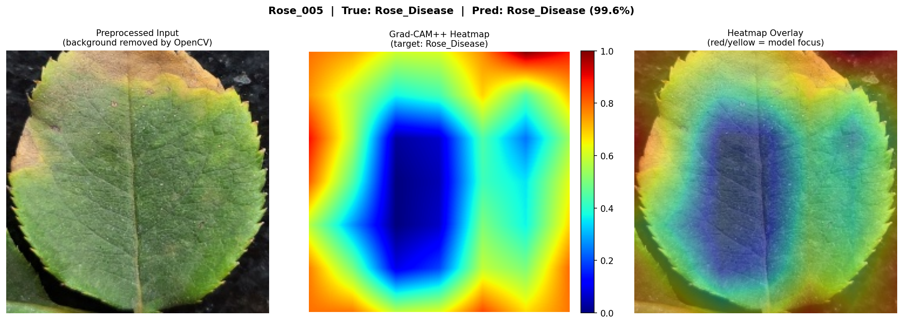
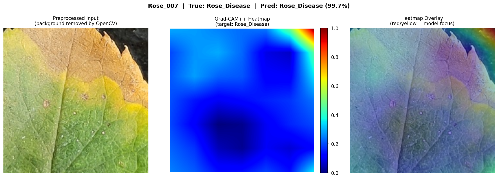
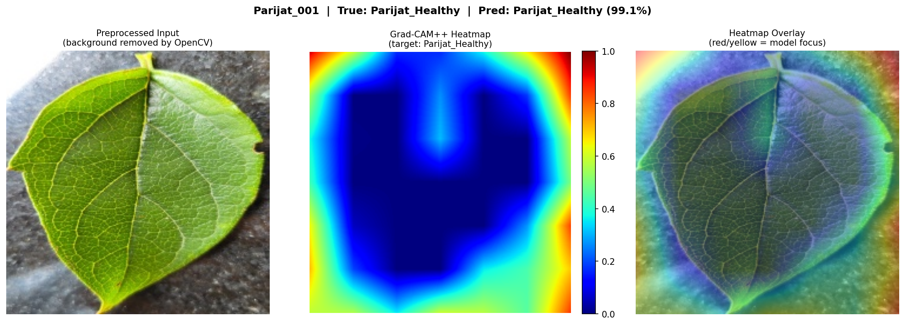
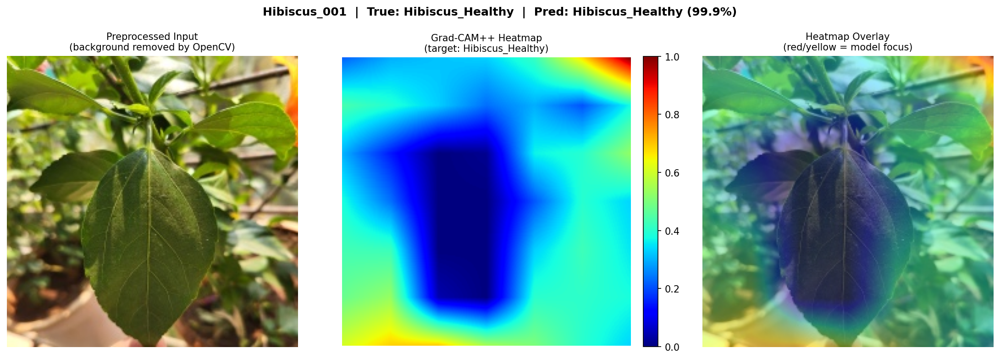

# 🌿 FloraGuard: Robust Plant Disease Diagnosis with Explainable AI


A research-grade computer vision system for plant disease diagnosis that goes beyond standard PlantVillage classifiers. FloraGuard combines a classical OpenCV preprocessing engine, a deep learning ablation study across three backbones, and Grad-CAM++ explainability — all deployed in an interactive Streamlit web app.

---

## The Problem

Most plant disease AI models are trained on PlantVillage — a dataset of perfect, studio-lit, single-leaf images on plain gray backgrounds. When deployed in the real world (messy backgrounds, shadows, variable lighting), these models fail because they learn to recognize the background, not the disease.

FloraGuard addresses this through three layers:

- **Layer 1 — Hybrid Dataset:** Combines PlantVillage (8,345 images, 7 classes) with real garden photos collected personally (45 images, 3 classes: Rose, Hibiscus, Parijat)
- **Layer 2 — OpenCV Preprocessing Pipeline:** HSV masking → morphological cleaning → contour-based ROI cropping → 224×224 resize. Removes backgrounds before images enter the model
- **Layer 3 — Grad-CAM Explainability:** Proves the model attends to disease regions, not background artifacts

---

## Results

### Ablation Study (Validation Set)

| Model | Parameters | Val Accuracy | Rank |
|---|---|---|---|
| EfficientNetB0 | 4.4M | 98.9% | 🥇 |
| ResNet50 | 24.1M | 98.7% | 🥈 |
| MobileNetV2 | 2.6M | 97.7% | 🥉 |

### Final Test Results (1,255 held-out images)

| Model | Test Accuracy | Macro F1 | Weighted F1 | FPS |
|---|---|---|---|---|
| **EfficientNetB0** | **99.04%** | **98.57%** | **99.05%** | 41.6 |
| ResNet50 | 98.96% | 98.48% | 98.97% | 46.9 |
| MobileNetV2 | 97.69% | 84.05% | 97.65% | 45.1 |

**Key finding:** MobileNetV2 shows a 13.6% gap between Macro F1 (84.05%) and Weighted F1 (97.65%), revealing failure to generalize to minority garden classes (15 images each) despite class weighting. EfficientNetB0 and ResNet50 handle the 140× class imbalance robustly.

---

## Grad-CAM Visualizations

EfficientNetB0 attention maps on garden images. Red = high attention · Blue = low attention.

**Rose_005** — Rose Disease (99.6% confidence)


**Rose_007** — Rose Disease (99.7% confidence)


**Parijat_001** — Parijat Healthy (99.1% confidence)


**Hibiscus_001** — Hibiscus Healthy (99.9% confidence)


---

## Dataset

| Source | Classes | Images |
|---|---|---|
| PlantVillage | Pepper Bacterial Spot, Pepper Healthy, Potato Early Blight, Potato Late Blight, Potato Healthy, Tomato Bacterial Spot, Tomato Healthy | 8,345 |
| Personal Garden (Mumbai, India) | Rose Disease, Hibiscus Healthy, Parijat Healthy | 45 |
| **Total** | **10 classes** | **8,390** |

Split: Train 80% (6,715) · Val 20% (1,676) · Test 15% (1,255) · seed=42

---

## Architecture

```
Input (224×224×3)
       │
       ▼
Lambda(efficientnet_preprocess)
       │
       ▼
EfficientNetB0 (frozen, ImageNet weights)
       │
       ▼
GlobalAveragePooling2D → BatchNormalization → Dense(256, relu) → Dropout(0.4) → Dense(10, softmax)
```

**Training:** Google Colab T4 GPU · Adam(lr=1e-4) · Categorical Crossentropy · Class weights · 20 epochs · EarlyStopping(patience=5)

---

## Project Structure

```
FloraGuard_Project/
├── scripts/
│   ├── preprocess.py              ← OpenCV preprocessing pipeline
│   ├── check_preprocessing.py     ← Preprocessing verification
│   └── app.py                     ← Streamlit web app
├── notebooks/
│   └── FloraGuard_Training.ipynb  ← Training, evaluation, Grad-CAM
├── reports/
│   ├── confusion_matrix_*.png
│   ├── comparison_table.png
│   └── gradcam/
├── requirements.txt
└── README.md
```
---

## Setup & Run

### Prerequisites
- Python 3.10+
- TensorFlow 2.20+
- Model weights file (see below)

### Installation

```bash
git clone https://github.com/TheBalace/FloraGuard.git
cd FloraGuard
pip install -r requirements.txt
```

### Model Weights

The trained model weights are not included in this repo (file size). To obtain them:

**Option A — Train from scratch:**
Open `notebooks/FloraGuard_Training.ipynb` in Google Colab and run all cells. Requires ~45 minutes on T4 GPU.

**Option B — Download pretrained weights:**
https://drive.google.com/file/d/19zDfXQbw4pzOdCE8nRVaTdBW_xN2kpwO/view?usp=sharing

Place the weights file at `models/efficientnet_best.keras`.

### Run the App

```bash
streamlit run scripts/app.py
```

Open `http://localhost:8501` in your browser.

---

## Preprocessing Pipeline

The OpenCV pipeline (`scripts/preprocess.py`) runs on every image before training and inference:

1. **BGR → HSV conversion** — HSV space is more robust to lighting variation than RGB
2. **HSV masking** — isolates green leaf regions (H: 25–95, S: 30–255, V: 30–255)
3. **Morphological closing** — fills small holes in the mask
4. **Morphological opening** — removes small noise artifacts
5. **Contour detection** — finds the largest green region (the leaf)
6. **Bounding box crop** — crops to the leaf with 10px padding
7. **Resize to 224×224** — model input size

---

## Technical Details

- **Explainability:** Manual Grad-CAM implementation using `tf.GradientTape` — compatible with Keras 3.x / TF 2.20+. Target layer: `top_conv` (7×7×1280 spatial resolution)
- **Class imbalance:** Handled via `sklearn.utils.class_weight.compute_class_weight` — garden classes weighted ~56× relative to majority classes
- **No Lambda layer at inference:** `preprocess_input` applied manually in Python to avoid Keras serialization issues across TF versions
- **FPS measured** on CPU (Intel/AMD local machine) — GPU inference would be significantly faster

---

## Limitations

- Garden classes (Rose, Hibiscus, Parijat) trained on only 15 images each — performance on unseen garden images is lower than PlantVillage classes
- HSV masking assumes green leaves — may fail on dried/severely diseased leaves with little green remaining
- `top_conv` at 7×7 resolution limits Grad-CAM to coarse localization — fine-grained lesion segmentation requires different approaches

---

## Tech Stack

| Component | Tool |
|---|---|
| Language | Python 3.10+ |
| Computer Vision | OpenCV |
| Deep Learning | TensorFlow 2.19 / Keras 3.x |
| Explainability | Manual Grad-CAM (tf.GradientTape) |
| Frontend | Streamlit |
| Training | Google Colab (T4 GPU) |

---

## Author

**Neil Shah** — Computer Engineering Student, India  
Built as a research-grade CV portfolio project targeting software and research internships.
